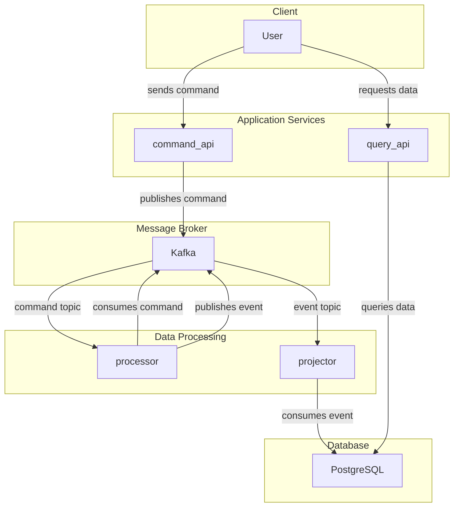
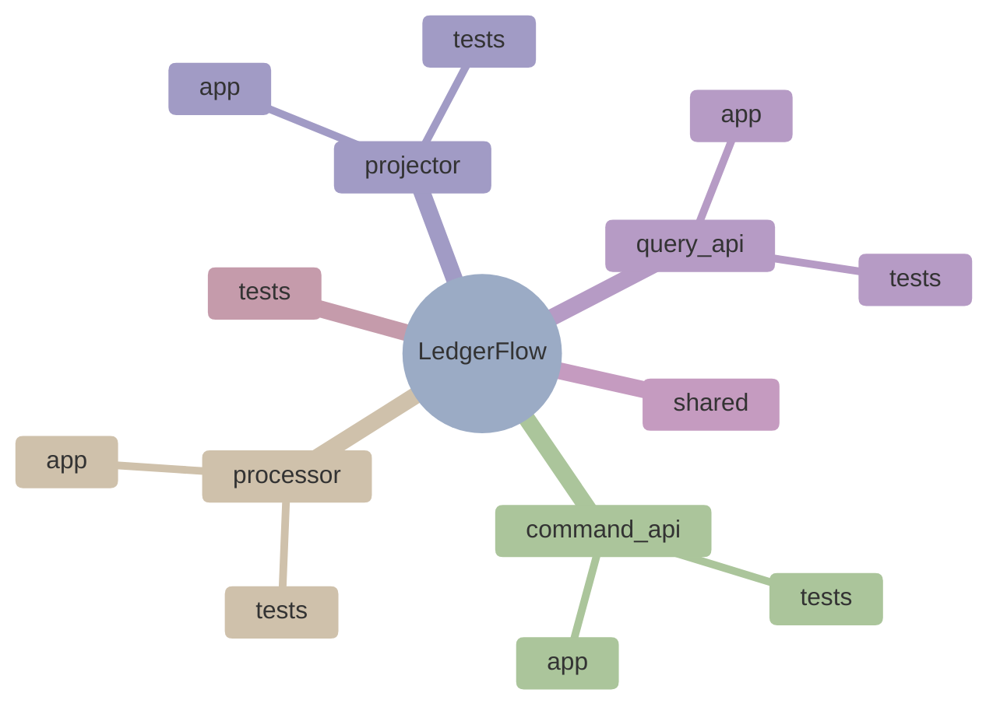

# LedgerFlow

[](https://www.python.org/downloads/)
[](https://github.com/astral-sh/ruff)
[](https://opensource.org/licenses/MIT)
[](https://github.com/romanvlad95/LedgerFlow/actions)

LedgerFlow is a small but production-style Python project that demonstrates an Event-Sourced Ledger architecture using Kafka, following the principles of Command Query Responsibility Segregation (CQRS).

## Tech stack

- **Python 3.11+**
- **FastAPI**: For building the `command_api` and `query_api`.
- **Kafka**: As a message broker for communication between services.
- **PostgreSQL**: As the database for the read model.
- **SQLAlchemy**: For ORM and database interaction.
- **Docker & Docker Compose**: For containerization and orchestration of the services.
- **Poetry**: For dependency management.
- **Pytest**: For testing.
- **Ruff**: For linting.

## Project Architecture

The system is designed with a microservices architecture, where each service has a distinct responsibility. This separation of concerns allows for a scalable, resilient, and maintainable system.



### Services

1.  **`command_api`**: A FastAPI service that exposes endpoints for clients to send commands (e.g., `CreateItemCommand`). It validates the command and publishes it to a Kafka topic named `commands`.
2.  **`processor`**: A Kafka consumer that listens to the `commands` topic. It processes the command, applies business logic, and produces a corresponding event (e.g., `ItemCreatedEvent`) to an `events` topic.
3.  **`projector`**: A Kafka consumer that subscribes to the `events` topic. It reads the events and projects them into a denormalized read model in a PostgreSQL database. This read model is optimized for querying.
4.  **`query_api`**: A FastAPI service that exposes REST endpoints for clients to query the read model from the PostgreSQL database.

## Why LedgerFlow Exists

Traditional monolithic applications often use a single database for both reads and writes, which leads to scalability bottlenecks, poor auditability, and tight coupling.  
LedgerFlow demonstrates how **CQRS (Command Query Responsibility Segregation)** combined with **Event Sourcing** can solve these problems using **Kafka** as the communication backbone.

### What Problems It Solves
- **Scalability** — separates write and read sides for independent scaling.
- **Resilience** — Kafka decouples services, allowing asynchronous recovery.
- **Auditability** — full event log provides an immutable history of changes.
- **Flexibility** — new read models can evolve without touching the write logic.

### Data Flow Overview
1. User sends a command → published to Kafka `commands` topic.
2. Processor consumes it → emits an event to `events` topic.
3. Projector consumes the event → updates PostgreSQL read model.
4. Query API serves the read data to clients.

## Getting Started

### Prerequisites

- Docker
- Docker Compose
- Python 3.11+
- Poetry

### Setup

1.  **Clone the repository:**

    ```bash
    git clone https://github.com/romanvlad95/LedgerFlow.git
    cd LedgerFlow
    ```

2.  **Set up the environment and install dependencies:**

    ```bash
    make setup
    ```

3.  **Run the services:**

    ```bash
    make up
    ```

## Makefile Commands

The `Makefile` provides a set of commands to simplify the development workflow:

- `make up`: Start all services in detached mode.
- `make down`: Stop and remove all services.
- `make restart`: Restart all services.
- `make build`: Build the Docker images.
- `make rebuild`: Rebuild the Docker images without using the cache.
- `make logs`: View the logs of all services.
- `make ps`: List the running services.
- `make clean`: Stop and remove all services, and prune the Docker system.
- `make lint`: Run the linter.
- `make test`: Run the tests.
- `make test-docker`: Run the tests in a Docker container.
- `make coverage`: Generate a test coverage report.
- `make verify`: Run all checks (linting and tests).

## Usage

Once the services are running, you can interact with the API:

*   **Create an item:**

    ```bash
    curl -X POST -H "Content-Type: application/json" -d '''{"name": "My First Item", "description": "A description of my item"}''' http://localhost:8000/items
    ```

*   **Get all items:**

    ```bash
    curl http://localhost:8003/items
    ```

*   **Get a specific item:**

    After creating an item, you can get its ID from the response of the `GET /items` endpoint.

    ```bash
    curl http://localhost:8003/items/{item_id}
    ```

## Code Quality

### Testing

To run the tests, use the following command:

```bash
make test
```

This will run the unit tests for the `command_api` and `query_api`, as well as the end-to-end integration test.

### Coverage

To generate a test coverage report, run:

```bash
make coverage
```

The report will be available at `htmlcov/index.html`.

### Linting and Verification

To check the code for style and quality, run:

```bash
make lint
```

To run all checks, including linting and tests in a Dockerized environment, use:

```bash
make verify
```

## Project Structure



- **`command_api`**: Contains the code for the command API service.
- **`processor`**: Contains the code for the command processing service.
- **`projector`**: Contains the code for the event projection service.
- **`query_api`**: Contains the code for the query API service.
- **`shared`**: Contains shared code, such as command and event models.
- **`tests`**: Contains integration tests.